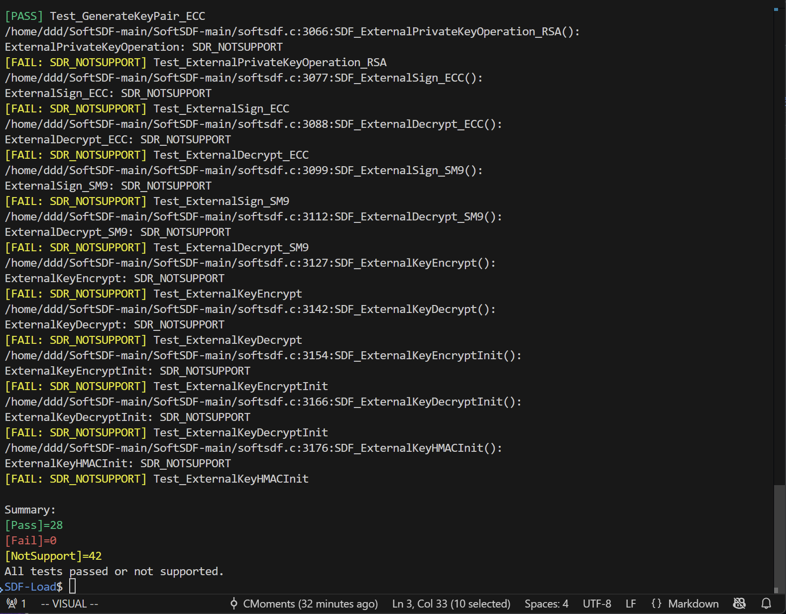
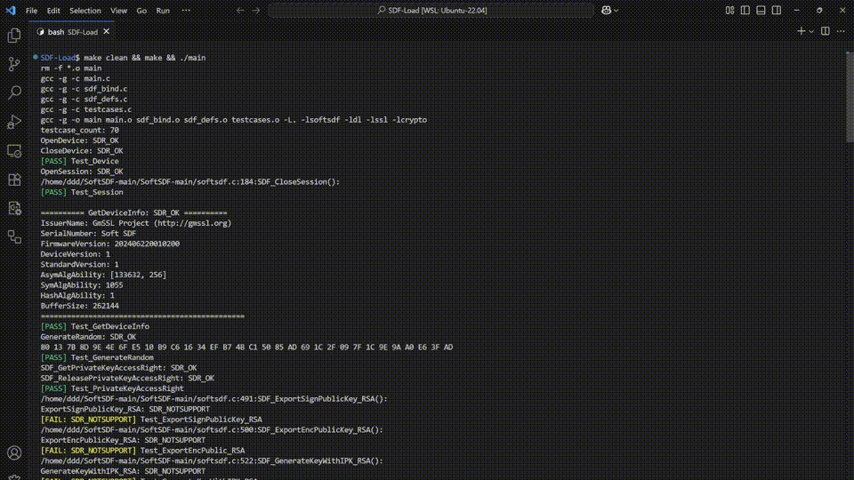

# SDF-Loader

本项目是一个 GM/T 0018-2023 SDF 接口测试框架

能够模拟业务场景对SDF标准接口进行调用测试，含详实注释，文档。

通过本项目能够帮助了解SDF标准接口应用业务场景，设计意图以及使用方式。

- 动态装载 + 覆盖 73 个 SDF/扩展验证接口测试。

- 已对齐 GM/T 0018-2023 SDF标准

## 目标

- 以动态方式加载厂商/软实现库 **libsoftsdf.so**，验证其对 GM/T 0018-2023 SDF 标准接口（及扩展验证接口）的符合性。
- 提供最小可维护的测试组织：每个接口一个 `Test_xxx()`。
- 作为后续开发/调试自测工具：新增或修正实现 ⇒ 立即运行全量用例查看回归。
- 
## 目录结构
```
.
├── README.md
├── Makefile
├── libsoftsdf.so           # 厂商/软实现库(这里使用的是GmSSL/SoftSDF)
├── main.c
├── sdf_bind.c
├── sdf_bind.h
├── sdf_defs.c
├── sdf_defs.h
├── testcases.c
├── testcases.h
├── softsdfinit            # 软设备初始化数据/模拟介质
├── docs				   # 相关资料以及学习文档
	├──SDF接口.md
	├──SDF接口关系.md
```

## 关键文件
- 动态加载与函数指针绑定: [sdf_bind.c](sdf_bind.c) / [sdf_bind.h](sdf_bind.h)
- SDF 类型与常量定义: [sdf_defs.h](sdf_defs.h)
- 软实现/辅助函数（含错误码字符串）: [sdf_defs.c](sdf_defs.c)
- 测试用例实现 (73 个): [testcases.c](testcases.c) + 统一声明 [testcases.h](testcases.h)
- 启动器 (加载库 + 调度): [main.c](main.c)
- 构建脚本: [Makefile](Makefile)

## 构建
以下命令生成 KEK 索引为 1、私钥索引为 1，密码为 P@ssw0rd 的密钥和文件：
模拟厂商设备初始化后，内部的持久密钥对。
```bash
softsdfinit -kek 1 -key 1 -pass P@ssw0rd
```
```bash
make          # 生成 ./main
make clean
```

## 运行
```bash
./main
```
输出包括各测试用例结果及总结统计 (Pass/Fail/NotSupport)。

## 添加新接口测试
1. 在 `testcases.c` 末尾新增：
   ```c
   int Test_NewInterface(){
       int ret = -1;
       void *hDev = NULL, *hSess = NULL;
       ret = OpenDevice(&hDev); if(ret) goto cleanup;
       ret = OpenSession(hDev, &hSess); if(ret) goto cleanup;
       // 调用目标接口，检查返回与期望
       // ret = Xxx(...);
       printf("NewInterface: %s\n", SDF_GetErrorString(ret));
   cleanup:
       if(hSess) CloseSession(hSess);
       if(hDev) CloseDevice(hDev);
       return ret;
   }
   ```
2. 在 `testcases.h` 添加 `int Test_NewInterface();`
3. 在集中调度（若有 `Test_all()`）或 `main.c` 中加入调用。
4. `make && ./main` 观察结果。

## 失败定位建议
- 返回码→`SDF_GetErrorString()`（位于 [sdf_defs.c](sdf_defs.c)）
- 若 `dlopen` 失败：确认当前目录下 `libsoftsdf.so` 与 `LD_LIBRARY_PATH`
- 某接口不支持：确认库中对应函数指针是否绑定为 NULL（检查 [sdf_bind.c](sdf_bind.c)）

## 常量与算法号
所有算法/错误码常量集中放入 [sdf_defs.h](sdf_defs.h)。新增或修订请统一维护，避免散落重复 `#define`。

## 致谢
- GM/T 0018-2023 标准
- OpenSSL / GmSSL 相关参考实现
- 项目内部软 SDF 模块 `libsoftsdf.so`



